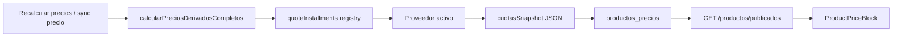

# Cotización de cuotas — proveedores modulares

> **Deprecado (2026-06):** La tienda ya no muestra montos por cuota ni cotiza vía API de proveedores. Solo copy cualitativo (`Hasta N cuotas con Mercado Pago`) usando `empresas.cuotas_financiado`. Este doc se conserva como referencia histórica hasta Release B (drop de columnas `precio_financiado`, `cuotas_snapshot`, `installment_provider`).

Sistema para mostrar en la tienda **“hacelo en N cuotas de $X”** alineado con el proveedor de financiación activo (hoy Mercado Pago; mañana un banco u otra plataforma).

El **frontend no conoce proveedores**: consume `InstallmentQuote` desde la API. Agregar un banco es trabajo de backend + config de empresa.

## Ubicación en código

| Pieza | Ruta |
|-------|------|
| Contrato de dominio | `api/src/types/installment.types.ts` |
| Interfaz proveedor | `api/src/services/installments/installment-provider.interface.ts` |
| Registry (Strategy) | `api/src/services/installments/installment-registry.ts` |
| Mercado Pago | `api/src/services/installments/mercadopago-installment.provider.ts` |
| Fallback estático | `api/src/services/installments/static-installment.provider.ts` |
| Orquestación precios | `api/src/services/precios-derivados.service.ts` |
| Recalcular / config empresa | `api/src/services/empresa-config.service.ts` |
| Persistencia | `productos_precios.cuotas_snapshot` (JSON), `empresas.installment_provider` |
| UI tienda (única) | `client/src/app/components/precio/ProductPriceBlock.tsx` |
| Copy cuotas | `client/src/app/utils/precioDisplay.ts` |

## Modelo `InstallmentQuote`

Contrato estable entre proveedor, BD, API y front:

```typescript
interface InstallmentQuote {
  provider: string;       // ej. 'mercado_pago', 'banco_nacion', 'static'
  cuotas: number;         // N
  montoCuota: number;     // valor por cuota
  totalFinanciado: number;
  sinInteres: boolean;
  moneda: 'ARS';
  cft?: string | null;    // obligatorio mostrar en detalle si hay interés (AR)
  tea?: string | null;
  referencia?: string | null;  // contexto (tarjeta ref, plan id, etc.)
  estimado?: boolean;     // true si es fallback / sin BIN
}
```

En productos publicados la API expone:

- `cuotas: InstallmentQuote | null` — fuente de verdad para la UI
- `precio3Cuotas` — alias deprecated de `cuotas.montoCuota` (compat)

## Flujo de datos



1. **Recalcular** (admin) o **upsert** de `ProductoPrecio` llama `calcularPreciosDerivadosCompletos`.
2. Eso consulta `quoteInstallments` con el `installmentProvider` de la empresa.
3. El resultado se guarda en `cuotas_snapshot` y `precio_financiado` (= `montoCuota`).
4. El listado/detalle de productos arma `PrecioPublico` vía `buildPrecioPublico`.
5. El front renderiza con `formatCuotasLine` → *“o hacelo en N cuotas de $X”*.

**Cotización en checkout (monto total):**

`GET /api/checkout/cuotas?amount=12345&cuotas=3` → mismo registry, sin auth.

## Configuración por empresa (BD)

Columnas en `empresas` (migración `api/migrations/add_installment_cuotas_snapshot.sql`):

| Columna | Default | Uso |
|---------|---------|-----|
| `installment_provider` | `mercado_pago` | ID del proveedor en el registry |
| `installment_provider_options` | `NULL` | JSON con opciones por proveedor |
| `cuotas_financiado` | `3` | N cuotas a cotizar y mostrar |

Ejemplo SQL para cambiar proveedor:

```sql
UPDATE empresas
SET
  installment_provider = 'mercado_pago',
  installment_provider_options = JSON_OBJECT(
    'mercado_pago', JSON_OBJECT(
      'paymentMethodId', 'visa',
      'binReferencia', '450799'
    )
  )
WHERE id = 1;
```

Tras cambiar proveedor o cuotas: **Admin → Configuración → Recalcular precios**.

### Opciones Mercado Pago

En `installment_provider_options.mercado_pago`:

| Campo | Env fallback | Descripción |
|-------|--------------|-------------|
| `paymentMethodId` | `MP_INSTALLMENT_PAYMENT_METHOD_ID` (default `visa`) | Marca para `/v1/payment_methods/installments` |
| `binReferencia` | `MP_INSTALLMENT_BIN_REFERENCIA` | Primeros 6 dígitos; más preciso pero sigue siendo referencia |

Sin credenciales MP o si la API falla → fallback automático a `static` (`lista ÷ N`, `estimado: true`).

## Proveedores incluidos

| ID | Clase | Comportamiento |
|----|-------|----------------|
| `mercado_pago` | `MercadoPagoInstallmentProvider` | `GET /v1/payment_methods/installments` |
| `static` | `StaticInstallmentProvider` | `montoCuota = monto / cuotas`, `sinInteres: true`, `estimado: true` |

## Cómo agregar un nuevo proveedor (ej. banco)

### 1. Extender tipos (opcional pero recomendado)

En `api/src/types/installment.types.ts`, agregar opciones del banco:

```typescript
export interface InstallmentProviderOptions {
  mercado_pago?: { paymentMethodId?: string; binReferencia?: string };
  banco_nacion?: { planId?: string; apiBaseUrl?: string };
}
```

Ampliar `InstallmentProviderId` si querés autocompletado estricto:

```typescript
export type InstallmentProviderId = 'mercado_pago' | 'static' | 'banco_nacion' | (string & {});
```

### 2. Implementar el provider

Crear `api/src/services/installments/banco-nacion-installment.provider.ts`:

```typescript
import type { InstallmentQuote, InstallmentQuoteInput } from '../../types/installment.types';
import type { InstallmentProvider } from './installment-provider.interface';

export class BancoNacionInstallmentProvider implements InstallmentProvider {
  readonly id = 'banco_nacion';

  async quote(input: InstallmentQuoteInput): Promise<InstallmentQuote | null> {
    const { monto, cuotas, config } = input;
    const opts = config.providerOptions.banco_nacion;
    // 1. Llamar API del banco (planId, monto, cuotas)
    // 2. Mapear respuesta a InstallmentQuote
    return {
      provider: this.id,
      cuotas,
      montoCuota: 0,           // desde API banco
      totalFinanciado: 0,
      sinInteres: false,
      moneda: 'ARS',
      cft: null,
      tea: null,
      referencia: opts?.planId ?? null,
    };
  }
}

export const bancoNacionInstallmentProvider = new BancoNacionInstallmentProvider();
```

**Reglas del mapeo:**

- `montoCuota` y `totalFinanciado` deben ser coherentes con lo que verá el comprador al pagar.
- Si hay interés: completar `cft` y `tea` (Res. E 51/2017 — el front los muestra en detalle vía `ProductPriceBlock`).
- Si la API del banco falla: devolver `null` (el registry reintenta con `static`) o delegar explícitamente a `staticInstallmentProvider.quote(input)`.

### 3. Registrar en el registry

En `api/src/services/installments/installment-registry.ts`:

```typescript
import { bancoNacionInstallmentProvider } from './banco-nacion-installment.provider';

const providers: Record<string, InstallmentProvider> = {
  mercado_pago: mercadoPagoInstallmentProvider,
  static: staticInstallmentProvider,
  banco_nacion: bancoNacionInstallmentProvider,
};
```

Alternativa sin tocar el mapa inicial (plugins / tests):

```typescript
import { registerInstallmentProvider } from './installments';
registerInstallmentProvider(bancoNacionInstallmentProvider);
```

Exportar desde `api/src/services/installments/index.ts` si hace falta uso externo.

### 4. Activar en la empresa

```sql
UPDATE empresas
SET installment_provider = 'banco_nacion',
    installment_provider_options = JSON_OBJECT(
      'banco_nacion', JSON_OBJECT('planId', 'plan-retail-3')
    )
WHERE id = 1;
```

Luego **Recalcular precios** en admin.

*(Futuro: selector en `PreciosTab` vía `PATCH /api/admin/empresa/config-precios` con `installmentProvider`.)*

### 5. Variables de entorno (si aplica)

Documentar en `.env.example` del API las credenciales del banco. **No** hardcodear secrets en `installment_provider_options` de BD.

### 6. Probar

- Unit test del provider con mock HTTP.
- `POST .../config-precios/recalcular` → verificar `cuotas_snapshot` en `productos_precios`.
- `GET /api/productos/publicados` → campo `cuotas`.
- `GET /api/checkout/cuotas?amount=100000` → misma cotización para total de carrito.

**El front no requiere cambios** si la respuesta respeta `InstallmentQuote`.

## Qué NO tocar al agregar un banco

| Capa | Motivo |
|------|--------|
| `ProductPriceBlock`, `ProductInfo`, `ProductCardPublicado` | Consumen `InstallmentQuote` genérico |
| `precioDisplay.formatCuotasLine` | Copy único para todos los proveedores |
| `calcularPrecioTransfer` / IVA en `precios.config.ts` | Independiente de financiación |
| Webhook / preferencia MP | Cobro real sigue en checkout MP; la cotización de catálogo es informativa |

Si el banco también procesa el **pago** (no solo cotiza), eso es otra integración (checkout / forma de pago), no este módulo.

## Sync S-Factory vs recalcular

| Proceso | Cotización cuotas |
|---------|-------------------|
| Sync masivo de precios (`producto-sync`, `stock-precios-sync`) | Sigue usando `calcularTodosLosPrecios` (sync, sin llamada externa) |
| Recalcular precios (admin) | Usa registry + proveedor activo → persiste `cuotas_snapshot` |
| Upsert `ProductoPrecio` | Usa registry |

Hasta recalcular, el front muestra fallback desde `precio_financiado` (`lista ÷ N`) vía `installmentQuoteFromStorage`.

## Referencias

- Mercado Pago installments: [consideraciones Argentina](https://www.mercadopago.com.ar/developers/es/docs/checkout-api-payments/additional-content/considerations-argentina)
- Cliente MP: [mercadopago-client.md](./mercadopago-client.md)
- Migración BD: `api/migrations/add_installment_cuotas_snapshot.sql`
